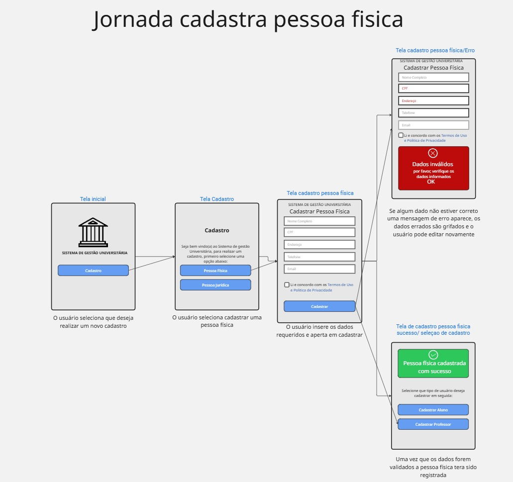
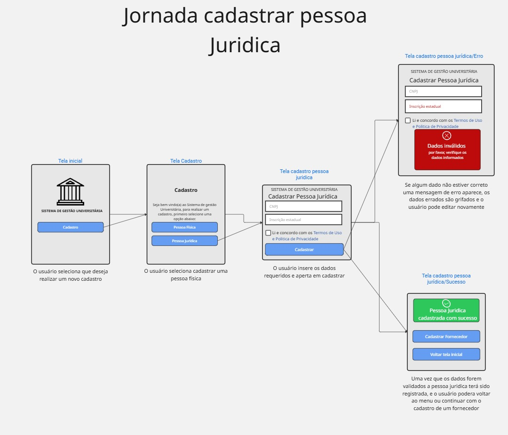
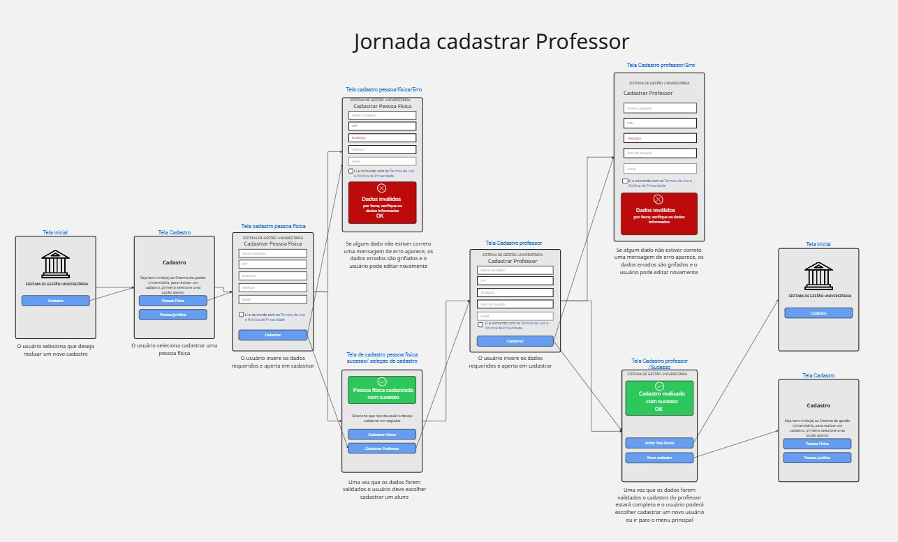
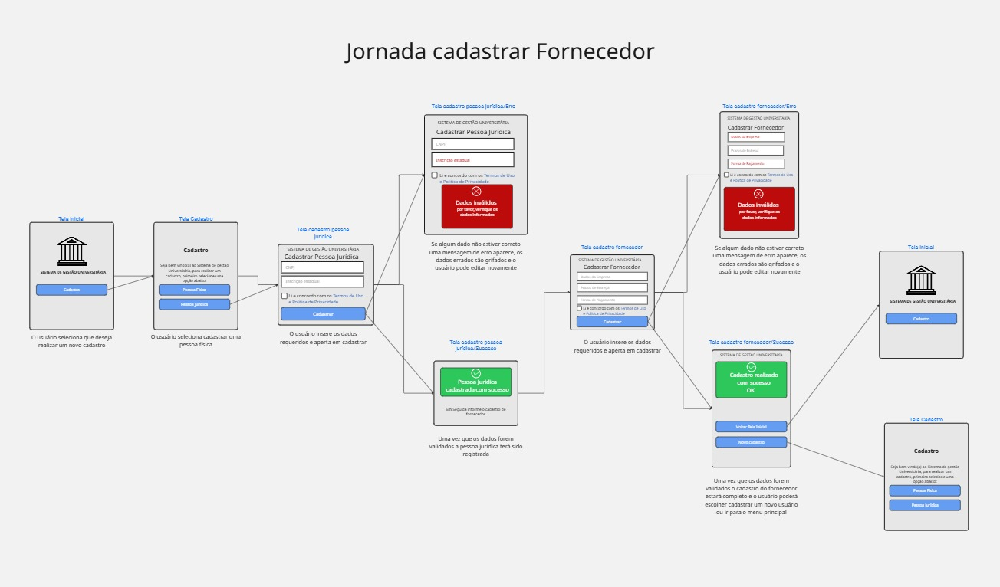
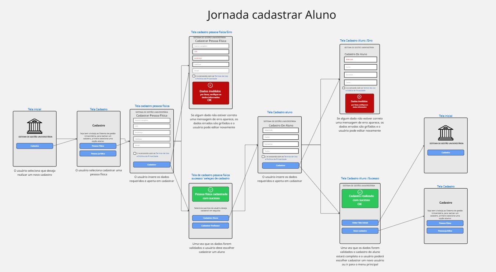
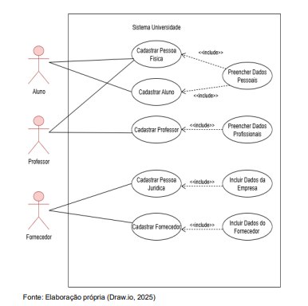

# PtiGrupo39
#  SISTEMA DE GESTÃO UNIVERSITÁRIA  
**Projeto Integrador – Fase 2 

##  1. Integrantes do Grupo

| Nome |
|------|
| Larissa Mariana de Souza Oliveira |
| Lilian Fernanda Pereira de Aguiar |
| Luana Alves do Santos |
| Mateus Nascimento Nogueira |
| Victor Mendes Ferreira Mello |

##  2. Descrição do Projeto  
Este repositório corresponde à **Fase 2 do Projeto Integrador**, cujo objetivo é desenvolver a prototipação das interfaces do Sistema de Gestão Universitária, com base nos modelos e diagramas elaborados na Fase 1.

As jornadas exigidas incluem:

- Cadastro de Pessoa Física  
- Cadastro de Pessoa Jurídica  
- Cadastro de Professores  
- Cadastro de Fornecedores  
- Cadastro de Alunos  

Todos os protótipos estão centralizados em um único quadro no **Miro**.

##  3. Protótipo Geral (Miro)

 **Acesse todos os protótipos aqui:**  
https://miro.com/app/board/uXjVJprU5dM=/

O quadro contém:

- Telas organizadas por tipo de cadastro  
- Fluxo de cada jornada de usuário  
- Descrições textuais e passos do processo  
- Navegação representada por setas e componentes interativos  

#  4. Jornadas do Usuário  

A seguir estão descritas as jornadas do usuário para cada processo do sistema, representando o fluxo de interação com o Sistema de Gestão Universitária.

##  4.1 Jornada – Cadastro de Pessoa Física

1. O usuário acessa a página de **Cadastro de Pessoa Física**.  
2. O sistema exibe um formulário contendo campos como: nome, endereço, e-mail, CPF, data de nascimento e sexo.  
3. O usuário preenche todos os campos obrigatórios.  
4. O sistema valida o CPF informado.  
5. Caso exista erro no preenchimento, o sistema destaca os campos inválidos e exibe mensagens de correção.  
6. Após validar os dados, o usuário confirma o cadastro clicando em **Salvar**.  
7. O sistema grava as informações no banco de dados.  
8. O sistema retorna uma mensagem de sucesso informando que a Pessoa Física foi cadastrada.  
9. O usuário pode escolher cadastrar outra pessoa ou voltar ao menu principal.

##  4.2 Jornada – Cadastro de Pessoa Jurídica

1. O usuário acessa a página de **Cadastro de Pessoa Jurídica**.  
2. É exibido um formulário com os campos: nome empresarial, endereço, e-mail, CNPJ e inscrição estadual.  
3. O usuário preenche os campos obrigatórios.  
4. O sistema valida automaticamente o CNPJ informado.  
5. Caso o CNPJ seja inválido ou exista erro no preenchimento, o sistema exibe alertas solicitando correção.  
6. Após validar todas as informações, o usuário confirma o cadastro.  
7. O sistema registra os dados no banco de dados.  
8. O sistema exibe uma mensagem confirmando o sucesso da operação.  
9. O usuário pode retornar ao menu inicial ou seguir para outro cadastro.

##  4.3 Jornada – Cadastro de Professores

1. O usuário acessa o menu e seleciona **Cadastro de Professores**.  
2. O sistema apresenta um formulário com dados pessoais e profissionais: nome, e-mail, endereço, especialidade e titulação.  
3. O usuário preenche os campos necessários.  
4. O sistema verifica se os campos obrigatórios foram preenchidos corretamente.  
5. Em caso de erro, o sistema mostra mensagens de orientação para correção.  
6. O usuário conclui a operação clicando em **Salvar**.  
7. O sistema registra o novo professor e exibe uma confirmação de sucesso.  
8. O usuário pode seguir cadastrando mais professores ou voltar ao menu principal.

##  4.4 Jornada – Cadastro de Fornecedores

1. O usuário acessa a interface de **Cadastro de Fornecedores**.  
2. O sistema exibe campos como: código, nome da empresa, tipo do produto, CNPJ e contato.  
3. O usuário preenche os dados solicitados.  
4. O sistema valida o CNPJ e os campos obrigatórios.  
5. Se houver inconsistências, o sistema informa os erros encontrados.  
6. O usuário confirma o cadastro após revisar as informações.  
7. O sistema armazena os dados do fornecedor.  
8. Uma mensagem é exibida confirmando que o fornecedor foi cadastrado com sucesso.  
9. O usuário retorna ao menu ou inicia um novo cadastro.

##  4.5 Jornada – Cadastro de Alunos

1. O usuário acessa a tela de **Cadastro de Alunos**.  
2. O sistema apresenta um formulário com os campos: nome, matrícula, curso e status.  
3. O usuário insere seus dados pessoais e acadêmicos.  
4. O sistema verifica se a matrícula já está em uso.  
5. Caso existam erros ou matrícula duplicada, o sistema informa ao usuário e solicita ajustes.  
6. Após a validação, o usuário confirma o cadastro.  
7. O sistema salva os dados do aluno.  
8. Uma mensagem de conclusão é exibida confirmando o cadastro bem-sucedido.  
9. O usuário pode cadastrar outro aluno ou retornar ao menu inicial.

##  5. Diagramas – Fase 1  

1. Diagrama de Casos de uso.

2. Diagrama de Classes.

##  6. Contato do Grupo  
Dúvidas podem ser enviadas diretamente no repositório através das *Issues*.

